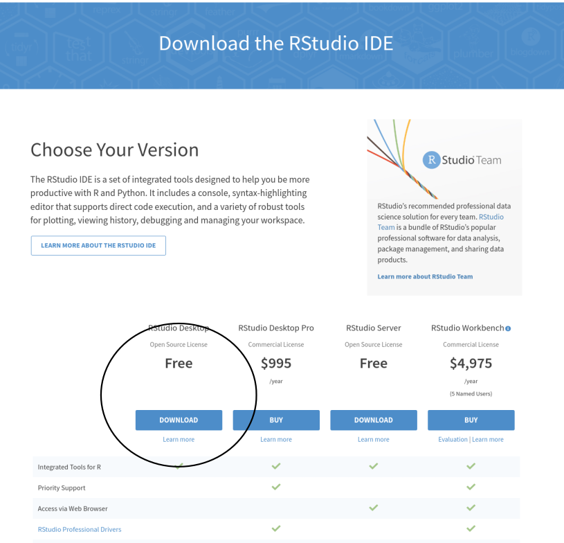
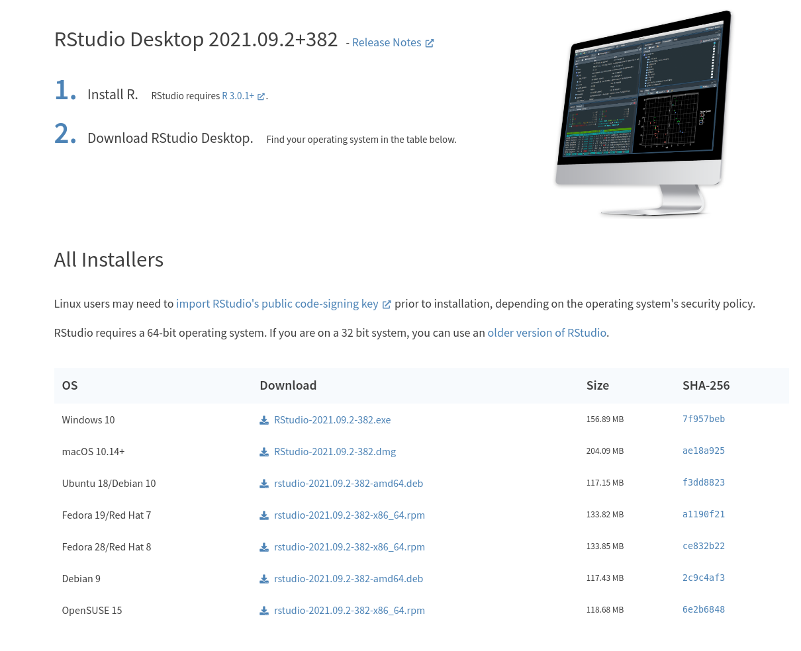
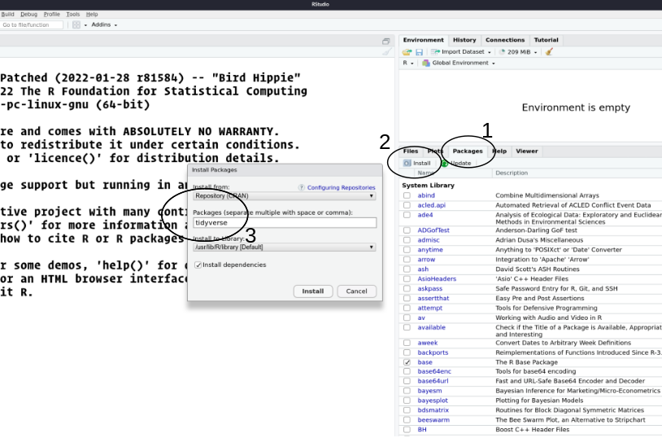

## Install R

To install `R` on **Windows**, we need to go to this page:
<http://cran.r-project.org/bin/windows/base/> and follow the first link
to download the installation program (**Download R 4.1.2 for Windows**).


Once the installation program is launched, you just have to install **R** with all the default options.

For **Mac OS X**, the installation files are available at
<http://cran.r-project.org/bin/macosx/>.


## Install RStudio

`Rstudio` need to be installed after `R` and to do that, you need to follow this url
<http://www.rstudio.com/products/rstudio/download/>.



And then you select the installer corresponding to your operating system.



## Install the R package tidyverse

`tidyverse` is a metapackage we will use during this training. You can do it from the command line, if you are familiar with `R` using the following code:

```{r, eval = FALSE}
install.packages("tidyverse", repos = "https://cloud.r-project.org/")
```

You can also use directly `RStudio` and its menu. You will need to go through the **`Package`** tab, then the **`Install`** tab and in the dialog box you have to type **`tidyverse`** in the text area.



