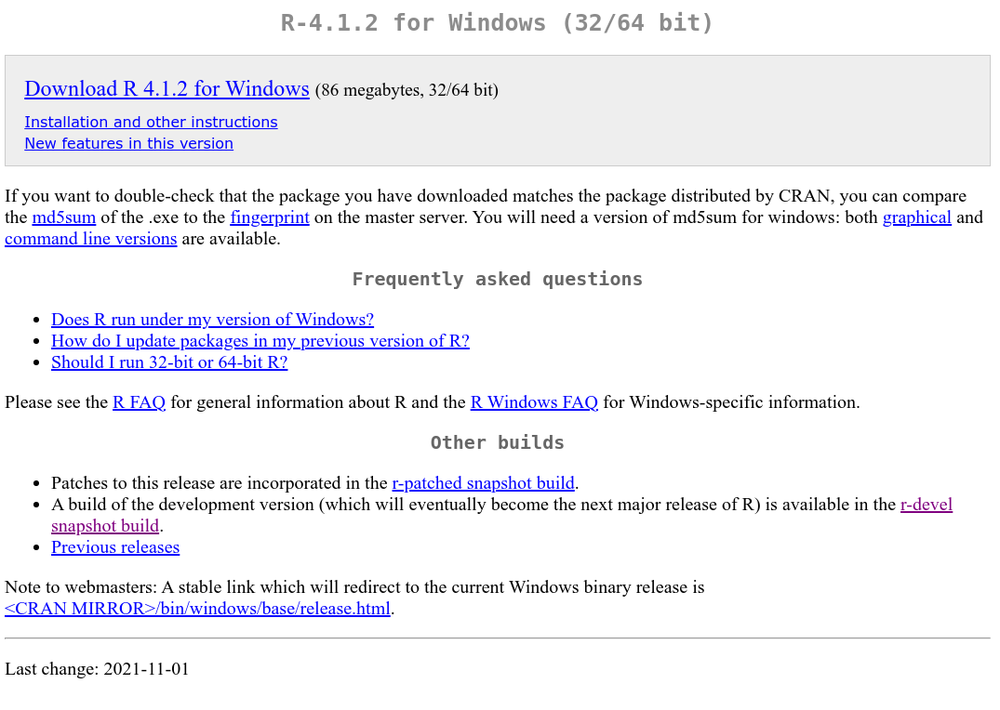
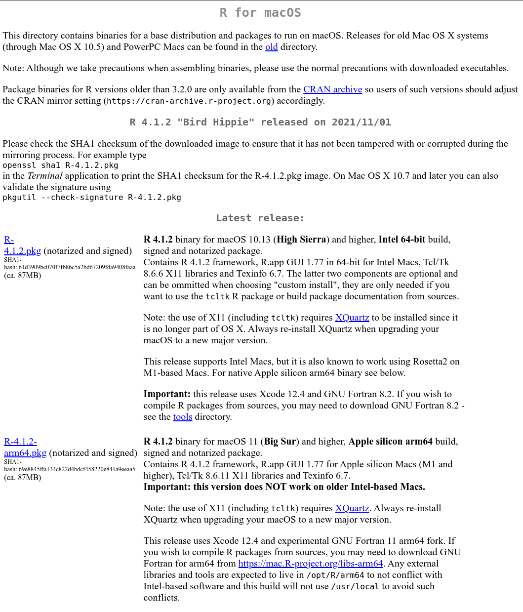

## R installation

To install `R` on **Windows**, we need to go to this page:
<http://cran.r-project.org/bin/windows/base/> and follow the first link
to download the installation program (**Download R 4.1.2 for Windows**).

Once the installation program is launched, you just have to install **R** with all the default options.

For **Mac OS X**, the installation files are available at
<http://cran.r-project.org/bin/macosx/>.

## RStudio installation

`Rstudio` need to be installed after `R` and to do that, you need to follow this url
<http://www.rstudio.com/products/rstudio/download/>. pour télécharger la dernière
version stable de **RStudio**. Plus précisément, il s'agit de l'édition *Open Source*
de **RStudio Desktop** (en effet, il existe aussi une version serveur).

Choisissez l'installateur correspondant à votre système d'exploitation et suivez
les instructions du programme d'installation.

Si vous voulez tester les dernières fonctionnalités de **RStudio**, vous pouvez
télécharger la version de développement (plus riche en fonctionnalités que la
version stable, mais pouvant contenir des bugs) sur
<http://www.rstudio.com/products/rstudio/download/preview/>.

## Installation des packages tidyverse et esquisse

Pour cette formation, nous allons utiliser plusieurs packages (add-on) **R** qu'il faudra installer
au préalable. Il s'agit des packages **tidyverse** et le package **esquisse**.

Je vous conseille la lecture de ce billet qui explique comment faire l'installation de R, **RStudio** et des packages:

https://quanti.hypotheses.org/1813
