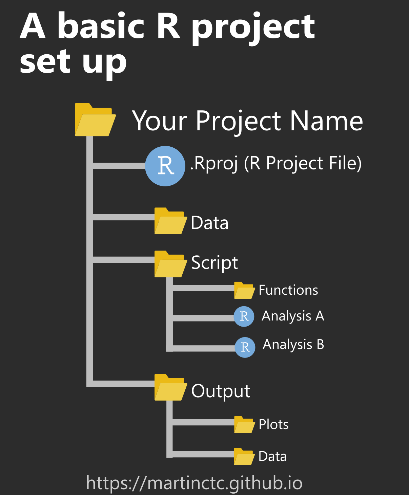

layout: true

<div class="my-footer"><span></span></div> 

```{r setup, include=FALSE}
extrafont::loadfonts(quiet=TRUE)
options(scipen = 999) # turn-off scientific notation like 1e+48

options(htmltools.dir.version = FALSE)
library(knitr)
knitr::opts_chunk$set(cache = TRUE, 
                      warning = FALSE, 
                      message = FALSE, 
                      dpi = 180,
                      fig.retina = 3,
                      fig.width = 6,
                      fig.asp = 0.618
                      )

library(fontawesome)

```

---
# Today will be about:

* Understanding basics

* Recap of packages

* Data import and export

* Organising your project


---
#1. Understanding basics

### How R works?

* R stores objects in memory (RAM) of your computer temporarily.

  + Objects appear in the Environment pane.
  
  + Objects could be anything.
  
  + Focus on 'data objects': vector, list, data frame, etc. 

### Basic code writing in R

---
# Recap of packages

##### "Packages are the fundamental units of reproducible R code."

* Install by writing a code
```{r, eval = FALSE, echo = TRUE}
install.packages("tidyverse")
```
* Install by clicking in RStudio

* Let R know the package to use
```{r, eval = FALSE, echo = TRUE}
library(tidyverse)
```

In RStudio, documents of packages are accessible in Help tab.
```{r, eval = FALSE, echo = TRUE}
?`tidyverse`
```

---
# Data import and export

### Setting working directory

* Absolute and relative path: Recommended to use relative path.
* `here()` package
```{r, eval = F, echo = T}
install.packages("here")
library(here)
here()
```


---
# Data import and export

### Import

* Use the dropdown menu (File > Import Dataset)
* Navigate in Files tab
* **Write a script with packages and functions**

The packages we need are: `readxl` to read excel, `writexl` to export data frame to excel, `haven` to read data in various formats such as .csv, Stata (.dta) and SPSS (.sav), and `pdftools` to read pdf.


---
# Data import and export

### Import

* csv: Refugee data of ASR 2020 from [Population Statistics Reference](https://popdata.unhcr.org/)
* Stata (.dta): Survey data, Understanding the socioeconomic conditions of refugees in Kalobeyei, Kenya 2018, from [RIDL](https://ridl.unhcr.org/dataset/ddi-unhcr-ken-socioeconomic-kalobei-survey-2018-v1-0)
* excel: Resettlement data from [Resettlement Statistics Report](https://rsr.unhcr.org/)
* pdf: South Africa government data of PoCs

### Export

---
# Data import and export

### Import directly from packages

* UNHCR open data from [Refugee Data Finder](https://www.unhcr.org/refugee-statistics/)
```{r, eval = F, echo = T}
install.packages("remotes") # install a required package
library(remotes)
remotes::install_github('unhcr/unhcrdatapackage') # install unhcrdatapackage
library(unhcrdatapackage)

popdata <- unhcrdatapackage::end_year_population_totals_long
head(popdata)
```

* World Bank open data
```{r, eval = F, echo = T}
install.packages("wbstats")
library(wbstats)

wb_ind <- c("NY.GDP.PCAP.CD", "NY.GDP.PCAP.KD.ZG", "FP.CPI.TOTL.ZG", "SI.POV.DDAY")
wb_df <- wb_data(indicator = wb_ind, country = "COD",
                 start_date = 1960, end_date = 2021)
```


---
# Organising your project

* Not recommended to store your workspace as .RData
  + Change it in Tools > Global Options in RStudio
  
```{r image_workspace, echo = FALSE, fig.width = 5, fig.align = "center"}
knitr::include_graphics("./images/workspace.png")
```

---
# Organising your project

.pull-left[
* Your project will be usually consisted of:
  + Data
  + Script
  + Results
  + Auxiliary files
]

.pull-right[
```{r image_structure, echo = FALSE, fig.align = "center"}

```
]

* Recommend to start with [Github](https://github.com) for version control

---
# Further reading

[R for Beginners](https://cran.r-project.org/doc/contrib/Paradis-rdebuts_en.pdf)

[R for Data Science](https://r4ds.had.co.nz/workflow-projects.html)

[Project-oriented workflow](https://www.tidyverse.org/blog/2017/12/workflow-vs-script/)


---

# Tomorrow (Day 3) will be about:

* Data manipulation: Selecting column, filtering, sorting, grouping, summarise, rename, create new columns, and so on.


